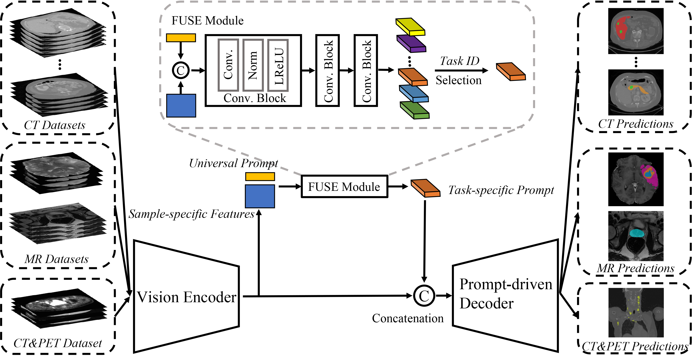
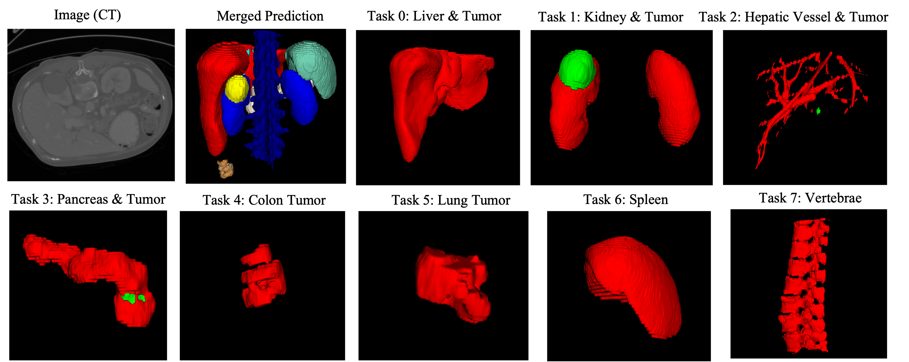

# UniSeg-code
This is the official pytorch implementation of our MICCAI 2023 paper "[UniSeg: A Prompt-driven Universal Segmentation Model as well as A Strong Representation Learner](https://arxiv.org/pdf/2304.03493.pdf)". 
In this paper, we propose a Prompt-Driven Universal Segmentation model (UniSeg) to segment multiple organs, tumors, and vertebrae on 3D medical images with diverse modalities and domains.

<div align="center">
  
</div>

## Requirements
CUDA 11.5<br />
Python 3.8<br /> 
Pytorch 1.11.0<br />
CuDNN 8.3.2.44

## Usage

### Installation
* Clone this repo.
```
git clone https://github.com/yeerwen/UniSeg.git
cd UniSeg
```

### Data Preparation
* Download [MOTS dataset](https://github.com/jianpengz/DoDNet).
* Download [VerSe20 dataset](https://github.com/anjany/verse).
* Download [Prostate dataset](https://liuquande.github.io/SAML).
* Download [BraTS21 dataset](https://www.synapse.org/#!Synapse:syn25829067/wiki/610863).
* Download [AutoPET2022 dataset](https://autopet.grand-challenge.org).

### Pre-processing
* Step 1:
  * Install nnunet by `pip install nnunet`.
  * Set path, for example:
    * `export nnUNet_raw_data_base="/data/userdisk0/ywye/nnUNet_raw"`
    * `export nnUNet_preprocessed="/erwen_SSD/1T/nnUNet_preprocessed"`
    * `export RESULTS_FOLDER="/data/userdisk0/ywye/nnUNet_trained_models"`

* Step 2:
  * `cd Upstream`
  * Note that the output paths of the preprocessed datasets should be in the `$nnUNet_raw_data_base/nnUNet_raw_data/` directory.
  * Run `python prepare_Kidney_Dataset.py` to normalize the name of the volumes for the Kidney dataset.
  * Run `python Convert_MOTS_to_nnUNet_dataset.py` to pre-process the MOTS dataset.
  * Run `python Convert_VerSe20_to_nnUNet_dataset.py` to pre-process the VerSe20 dataset and generate `splits_final.pkl`.
  * Run `python Convert_Prostate_to_nnUNet_dataset.py` to pre-process the Prostate dataset and generate `splits_final.pkl`.
  * Run `python Convert_BraTS21_to_nnUNet_dataset.py` to pre-process the BraTS21 dataset and generate `splits_final.pkl`.
  * Run `python Convert_AutoPET_to_nnUNet_dataset.py` to pre-process the AutoPET2022 dataset and generate `splits_final.pkl`.

* Step 3:
  * Copy `Upstream/nnunet` to replace `nnunet`, which is installed by `pip install nnunet` (the address is usually 'anaconda3/envs/your envs/lib/python3.8/site-packages/nnunet').
  * Run `nnUNet_plan_and_preprocess -t 91 --verify_dataset_integrity --planner3d MOTSPlanner3D`.
  * Run `nnUNet_plan_and_preprocess -t 37 --verify_dataset_integrity --planner3d VerSe20Planner3D`.
  * Run `nnUNet_plan_and_preprocess -t 20 --verify_dataset_integrity --planner3d ProstatePlanner3D`.
  * Run `nnUNet_plan_and_preprocess -t 21 --verify_dataset_integrity --planner3d BraTS21Planner3D`.
  * Run `nnUNet_plan_and_preprocess -t 11 --verify_dataset_integrity --planner3d AutoPETPlanner3D`.
  * Move `splits_final.pkl` of each dataset to the address of its pre-processed dataset. For example, '***/nnUNet_preprocessed/Task091_MOTS/splits_final.pkl'. Note that, to follow [DoDNet](https://github.com/jianpengz/DoDNet), we provide `splits_final.pkl` of the MOTS dataset in `Upstream/MOTS_data_split/splits_final.pkl`.
  * Run `python merge_each_sub_dataet.py` to form a new dataset.
  * To make sure that we use the same data split, we provide the final data split in `Upstream/splits_final_11_tasks.pkl`.


### Training and Test
* Move `Upstream/run_ssl.sh` and `Upstream/UniSeg_Metrics_test.py` to `"***/nnUNet_trained_models/"`.
* cd `***/nnUNet_trained_models/`.
* Run `sh run_ssl.sh` for training (GPU Memory Cost: ~10GB, Time Cost: ~210s each epoch).

### Pretrained weights 
* Upstream trained model is available in [UniSeg_11_Tasks](https://drive.google.com/file/d/1Ldgd5Ebc8VQrvGIpIgzUG2PTSDPUpEQJ/view?usp=sharing).

### Downstream Tasks
* `cd Downstream`
* Download [BTCV dataset](https://www.synapse.org/#!Synapse:syn3193805/wiki/217789).
* Download [VS dataset](https://wiki.cancerimagingarchive.net/pages/viewpage.action?pageId=70229053).
* Run `python Convert_BTCV_to_nnUNet_dataset.py` to pre-process the BTCV dataset and generate `splits_final.pkl`.
* Run `python Convert_VSseg_to_nnUNet_dataset.py` to pre-process the VS dataset and generate `splits_final.pkl`.
* Update the address of the pre-trained model in the 'Downstream/nnunet/training/network_training/UniSeg_Trainer_DS.py' file (line 97)
* Copy `Downstream/nnunet` to replace `nnunet`, which is installed by `pip install nnunet` (the address is usually 'anaconda3/envs/your envs/lib/python3.8/site-packages/nnunet').
* Run `nnUNet_plan_and_preprocess -t 60 --verify_dataset_integrity`.
* Run `nnUNet_plan_and_preprocess -t 61 --verify_dataset_integrity`.
* Move `splits_final.pkl` of two datasets to the addresses of their pre-processed datasets.
* To make sure that we use the same data split for the downstream datasets, we provide the final data splits in `Downstream/splits_final_BTCV.pkl` and `Downstream/splits_final_VS.pkl`.
* Training and Test:
    * For the BTCV dataset: `CUDA_VISIBLE_DEVICES=0 nnUNet_n_proc_DA=32 nnUNet_train 3d_fullres UniSeg_Trainer_DS 60 0`
    * For the VS dataset: `CUDA_VISIBLE_DEVICES=0 nnUNet_n_proc_DA=32 nnUNet_train 3d_fullres UniSeg_Trainer_DS 61 0`

### Prediction on New Data
* `cd Upstream`
* Copy `Upstream/nnunet` to replace `nnunet`, which is installed by `pip install nnunet`
* Run `CUDA_VISIBLE_DEVICES=1 nnUNet_n_proc_DA=32 nnUNet_predict -i /data/userdisk0/ywye/nnUNet_raw/nnUNet_raw_data/Test/Image/ -o /data/userdisk0/ywye/nnUNet_raw/nnUNet_raw_data/Test/Predict/10/ -t 97 -m 3d_fullres  -tr UniSeg_Trainer -f 0 -task_id 7 -exp_name UniSeg_Trainer -num_image 1 -modality CT -spacing 3.0,1.5,1.5`
  * `-i`: Path of the input image(s), name format of the input image: name_0000.nii.gz (name_0001.nii.gz)
  * `-o`: Path of the output mask(s)
  * `-task_id` Selected Task. 
    * `-1` means predicting all tasks under a specific modality. 
    * 0: "liver and liver tumor"
    * 1: "kidney and kidney tumor"
    * 2: "hepatic vessel and hepatic tumor"
    * 3: "pancreas and pancreas tumor"
    * 4: "colon tumor"
    * 5: "lung tumor"
    * 6: "spleen" 
    * 7: "vertebrae"
    * 8: "prostate"
    * "9": "brain tumors: edema, non-enhancing, and enhancing"
    * "10": "whole-body tumors"
  * `-num_image`: Channel number of the input image(s)
  * `-modality`: "CT" or "MR" or "CT,PET"
  * `-spacing`: Spacing of resampled image(s)

<div align="center">
  
</div>


## To do
- [x] Dataset Links
- [x] Pre-processing Code
- [x] Upstream Code Release
- [x] Upstream Trained Model
- [x] Downstream Code Release
- [x] Inference of Upstream Trained Model on New Data

## Citation
If this code is helpful for your study, please cite:

```
@article{ye2023uniseg,
  title={UniSeg: A Prompt-driven Universal Segmentation Model as well as A Strong Representation Learner},
  author={Yiwen Ye, Yutong Xie, Jianpeng Zhang, Ziyang Chen, and Yong Xia},
  booktitle={Medical Image Computing and Computer Assisted Intervention -- MICCAI 2023},
  year={2023}
}
```

## Acknowledgements
The whole framework is based on [nnUNet v1](https://github.com/MIC-DKFZ/nnUNet/tree/nnunetv1).

## Contact
Yiwen Ye (ywye@mail.nwpu.edu.cn)
